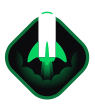

<h1 align="center">NLW Return Impulse</h1>

Trilha Impulse do NLW Return.

  

  
  
  

  <a href="#-tecnologias">Tecnologias</a>&nbsp;&nbsp;&nbsp;|&nbsp;&nbsp;&nbsp;
  <a href="#-projeto">Projeto</a>&nbsp;&nbsp;&nbsp;|&nbsp;&nbsp;&nbsp;
  <a href="#-layout">Layout</a>&nbsp;&nbsp;&nbsp;|&nbsp;&nbsp;&nbsp;
  <a href="#-como-executar">Como executar</a>&nbsp;&nbsp;&nbsp;|&nbsp;&nbsp;&nbsp;

## ✨ Tecnologias

Esse projeto foi desenvolvido com as seguintes tecnologias:
- [Web 🌐](./web):
  - [Vite](https://vitejs.dev/)
  - [React](https://reactjs.org)
  - [TypeScript](https://www.typescriptlang.org/)
- [Server 💻](./server):
  - [Node.js](https://nodejs.org/en/)
  - [TypeScript](https://www.typescriptlang.org/)

## 💻 Projeto

O Feedback Widget tem como objetivo um usuário anonimo cadastrar um feedback, sendo ele bug, idea ou outros, os códigos realizados neste projeto foi ao final da trilha impulse do evento Next Level Week, realizado pela [Rocketseat](https://www.rocketseat.com.br/).
O projeto é dividido em, _front-end_, _back-end_ e _mobile_. Cada parte está em um diretório separado, o back-end API foi criada com uma arquitetura bem definida e desacoplada, utilizando TDD (programação orientada a testes) como metodologia de trabalho, Clean Architecture para fazer a distribuição de responsabilidades em camadas, sempre seguindo os princípios do SOLID e, sempre que possível, aplicando Design Patterns para resolver alguns problemas comuns. .

## 🔖 Layout

Você pode visualizar o layout do projeto através [desse link](https://www.figma.com/file/VYGIFEa3ejW4Sx4PFy6Iuj/Feedback-Widget). É necessário ter conta no [Figma](http://figma.com/) para acessá-lo.

## 🚀 Como executar

- Clone o repositório
- Instale as dependências com `npm install`
- Para iniciar o servidor em modo desenvolvimento deve-se remover a linha nº1 `"import 'module-alias/register'"` no arquivo file
- Inicie o servidor em modo desenvolvedor `npm run dev`
- Faça a build do projeto `npm run build`
- Iniciar o projeto `npm run start`

Agora você pode acessar web [`localhost:3000`](http://localhost:3000)
Agora você pode acessar server [`localhost:3333/api`](http://localhost:3333/api)

## 💜 Agradecimentos

- [Rocketseat](https://www.rocketseat.com.br/)
- [Notion](https://efficient-sloth-d85.notion.site/Impulse-58f2daadb8e1433894420cbc57571087)
- [Layout](https://www.figma.com/community/file/1102912516166573468)

---

Feito com ♥ by Elivelton Santos 👋🏻